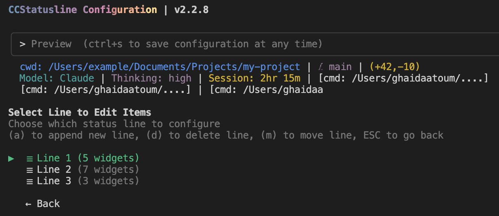
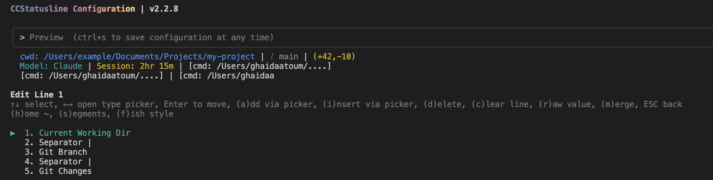
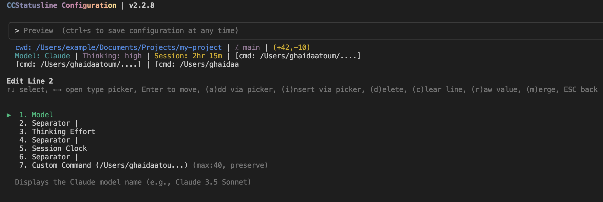
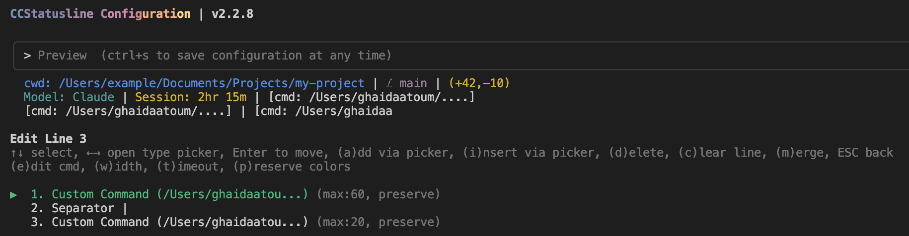

# Statusline v2 — TUI setup guide

Step-by-step for configuring `ccstatusline` to render the claude-tracker v2 statusline (3 lines: colored context bar, 5h reset countdown, current-session cost).

> 📸 **About the screenshots:** the images below are from `ccstatusline` v2.2.8 on macOS. Your TUI may differ slightly per version, but the flow is the same.

You should already have:
- Edited `~/.claude/settings.json` → `statusLine.command` set to `"npx -y ccstatusline@latest"` with `"padding": 0`
- Run `bash <plugin-dir>/statusline/install-ccstatusline.sh` once — **save its output**; it contains the three `commandPath` strings you'll paste in step 7. Those strings are resolved for *your* machine — do not copy the example paths from this guide.

---

## Where does `<plugin-dir>` live on my machine?

The install script prints the right absolute path regardless of how you installed the plugin. But if you ever need to find it yourself:

| Install method | Typical plugin path |
|---|---|
| **Marketplace** (`/plugin install claude-tracker@<marketplace>`) | `~/.claude/plugins/cache/<marketplace-name>/claude-tracker/<version>/` |
| **Local git clone** | `<wherever-you-cloned>/plugins/productivity/claude-tracker/` |

> ⚠️ **Marketplace paths include the plugin version** (e.g. `.../claude-tracker/0.3.0/...`). Every time you upgrade the plugin, the absolute path changes — the old `<version>` directory is swapped for the new one. Rerunning `install-ccstatusline.sh` from the new install dir detects this, rewrites each Custom Command widget's `commandPath` in `~/.config/ccstatusline/settings.json` in place (backup written to `.bak`), and exits. Just restart Claude Code — no TUI re-paste needed. (Local clones don't have this problem — the path stays put.)

Everywhere this guide shows `<PYTHON>` or `<PLUGIN_DIR>`, substitute the strings the install script printed for you.

---

## 1. Launch the TUI

In a terminal (not inside Claude Code):

```bash
npx -y ccstatusline@latest
```

You'll land on the **CCStatusline Configuration** main menu:

```
Main Menu
▶  Edit Lines
   Edit Colors
   Powerline Setup
   Terminal Options
   Global Overrides
   Uninstall from Claude Code
   Exit
```

At the top is a live **Preview** of the current configuration. On a fresh install it typically shows one line, e.g. `Model: Claude | Ctx: 18.6k | ⌘ main (+42,-10)`.

> 💾 **At any point you can press `Ctrl+S` to save** without leaving the TUI. The config is written to `~/.config/ccstatusline/settings.json`.

---

## 2. Open the Line editor

From the main menu: select **Edit Lines** (Enter).

You'll see the list of lines currently configured. Probably just **Line 1** with a few default widgets (Model, Context, Git).

---

## 3. Target layout — 3 lines

Aim for **3 lines**:

| Line | Widgets |
|---|---|
| **1** | Current Working Directory · Git Branch · Git Changes |
| **2** | Model · **Thinking Effort** · Session Clock · **Custom Command** (ctx bar) |
| **3** | **Custom Command** (5h reset countdown + block cost) · **Custom Command** (session cost) |

> 🆕 **Thinking Effort** is a ccstatusline built-in widget (Category: Core) that shows the current thinking level — `low` / `medium` / `high` / `max`. Available in ccstatusline v2.3+.

When you're done, the Lines overview should look like this:



You'll likely need to:
- Edit Line 1 to match (add CWD if missing, add Git widgets if missing)
- Add two new lines (Line 2, Line 3)
- Add three Custom Command widgets total (one on line 2, two on line 3)

---

## 4. Edit Line 1 — path + git

On Line 1, the widgets you want (in order):

1. **Current Working Directory** (some versions call it "CWD" or "Working Dir")
2. **Separator** (`|`)
3. **Git Branch**
4. **Separator** (`|`)
5. **Git Changes** (or separately: Git Insertions + Git Deletions)



To add a widget: usually there's an "Add Widget" option within the line editor (or an `(a)` keybind). Pick it, then scroll through the widget catalog and select the one you want.

To reorder: most TUI versions let you move widgets up/down with arrow keys or dedicated keybinds shown at the bottom of the screen.

To delete an unwanted default widget: select it, look for a "Remove" option or a `(d)`/Delete keybind.

> **Tip:** keep an eye on the Preview at the top — it updates live as you add/remove widgets. That's your ground truth.

---

## 5. Add Line 2 — model + thinking effort + session + ctx bar

Back out to the Lines list. Pick "Add Line" (or similar). On the new Line 2, add (in order):

1. **Model**
2. **Separator** (`|`)
3. **Thinking Effort** (Category: Core — `low`/`medium`/`high`/`max`)
4. **Separator** (`|`)
5. **Session Clock** (or "Session Duration")
6. **Separator** (`|`)
7. **Custom Command** ← this one renders our colored Ctx bar



Keep reading for how to configure the Custom Command in step 7.

---

## 6. Add Line 3 — 5h reset + session cost

Add another line (Line 3). Add (in order):

1. **Custom Command** ← 5h reset countdown + block cost
2. **Separator** (`|`)
3. **Custom Command** ← current Claude Code session cost



---

## 7. Configure each Custom Command

For every Custom Command widget you added in steps 5 and 6, open its widget options and set:

| Option | Value |
|---|---|
| `commandPath` | one of the three strings from the install script output |
| `preserveColors` | **true** (critical — without this, the ANSI colors get stripped) |
| `timeout` | `1000` (milliseconds; default) |
| `maxWidth` | optional; `40` for ctx, `60` for block, `20` for session is a good start |

**commandPath values** — these look like:

**Ctx segment** (line 2):
```
<PYTHON> <PLUGIN_DIR>/statusline/render_segments.py --segment ctx
```

**Block segment** (line 3, first):
```
<PYTHON> <PLUGIN_DIR>/statusline/render_segments.py --segment block
```

**Session segment** (line 3, second):
```
<PYTHON> <PLUGIN_DIR>/statusline/render_segments.py --segment session
```

**Don't retype these.** Copy the three fully-resolved strings printed by `install-ccstatusline.sh` — it already figured out your Python interpreter and your plugin install path. They will look like one of:

- `~/.claude/plugins/cache/<marketplace>/claude-tracker/<version>/statusline/render_segments.py …` (marketplace install — note the version segment)
- `/path/to/your/clone/plugins/productivity/claude-tracker/statusline/render_segments.py …` (local clone)

> ⚠️ **Don't use plain `python3 …` and don't use `~/.pyenv/shims/python3`** — the pyenv shim adds ~1 s per invocation and will exceed ccstatusline's 1000 ms timeout, so every render will dim-fallback. Use the absolute interpreter path (the one the install script prints; `install-ccstatusline.sh` refuses to emit a shim and will tell you how to find the real path if it can't resolve one).
>
> If your current `commandPath` already contains `/shims/` (e.g. you configured this before the install script hardened against it), run `pyenv which python3` in a terminal — the result is the real interpreter you want to paste.

---

## 8. Preview check

The Preview at the top of the TUI should now look something like this (colors in your terminal):

```
~/plugin-playground  ⎇ main (+2,-1)
Opus 4.7  ·  high  ·  Session 12m  ·  Ctx ▓▓▓▓▓░░░░░ 52% (104K/1M)
5h ▓▓▓▓▓▓▓▓░░ 29m → 6pm · $16.08  ·  💬 Session $0.42
```

- **Ctx bar** should be green if < 70%, yellow 70–89%, red ≥ 90%.
- **Thinking Effort** shows `low`/`medium`/`high`/`max` — whichever matches your current selection in Claude Code's model picker.
- **5h bar** fills as the clock-hour-aligned 5h block elapses; same color thresholds (red = nearly out of time). The "Xh Ym → 6pm" format shows both remaining time and the local clock hour the block resets at — matches the reset hour `/usage` reports for the subscription.
- **💬 Session** is cost of the current Claude Code conversation (resets on `/clear` or a new session).
- **Numbers visible at all** = your `commandPath` and `preserveColors` are configured correctly.
- If a Custom Command shows dim dashes (`░░░░ ??%`) — that's the cold-cache fallback. Wait ~2 seconds and it populates.

---

## 9. Save & exit

Press **Ctrl+S** to save. The TUI writes to `~/.config/ccstatusline/settings.json`.

Select **Exit** from the main menu.

---

## 10. Restart Claude Code

Close and re-open Claude Code. The new 3-line statusline should render at the bottom of the window.

If it doesn't, sanity-check in order:

1. `~/.claude/settings.json` has `"command": "npx -y ccstatusline@latest"` with `"padding": 0`
2. `~/.config/ccstatusline/settings.json` exists and has 3 lines (`cat ~/.config/ccstatusline/settings.json | head -40`)
3. Run one of the commandPath strings manually — substitute the `<PYTHON>` and `<PLUGIN_DIR>` the install script printed:
   ```bash
   echo '{}' | <PYTHON> <PLUGIN_DIR>/statusline/render_segments.py --segment block
   ```
   Should print the `5h … Xh Ym → 6pm · $xx.xx` line (or a dim fallback on a truly cold cache).

---

## Optional additions

- **Team plan quota**: add `SessionUsage` and `WeeklyUsage` widgets (only work on Team plan).
- **Custom context limit**: set the env var `CLAUDE_CTX_LIMIT=200000` (or any integer) in your shell profile to override the per-model default.

---

## Reconfiguring later

Just re-run `npx -y ccstatusline@latest`. Your saved config is picked up automatically; you can tweak and re-save without starting over.

### After upgrading the plugin (marketplace users)

Marketplace installs live at a versioned path (`…/claude-tracker/<version>/…`), so **every plugin upgrade breaks the old `commandPath` strings** saved in `~/.config/ccstatusline/settings.json`. The statusline will fall back to dim dashes until you refresh.

To recover, rerun the install script from the new install dir:

```bash
bash ~/.claude/plugins/cache/<marketplace-name>/claude-tracker/<new-version>/statusline/install-ccstatusline.sh
```

The script detects the existing claude-tracker widgets and rewrites each `commandPath` in place (preserving `--segment`, `preserveColors`, `timeout`, `maxWidth`, and every non-claude-tracker widget). A backup is written to `~/.config/ccstatusline/settings.json.bak`. Restart Claude Code to pick up the new paths — no TUI re-paste, no manual copy/paste.

If your widgets don't have a `render_segments.py` path yet (first-time setup) the script falls back to printing the manual TUI steps.

Local-clone installs don't have this problem — the path stays put across `git pull`s, so the script typically has nothing to patch.
