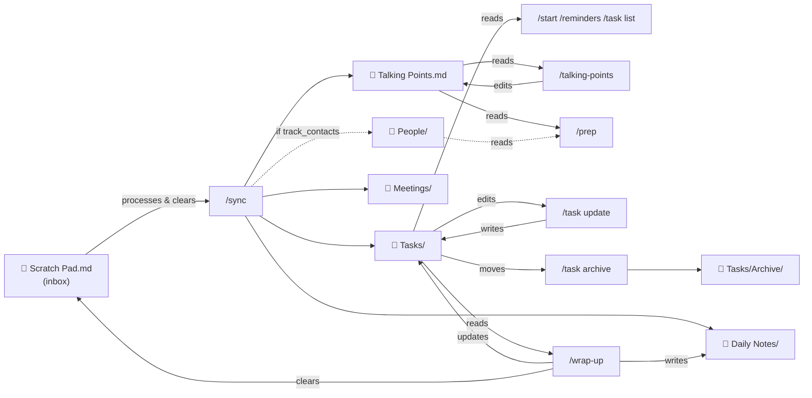

# Contributing to daily-notes

## Technical architecture

### Data flow — what each skill reads and writes

This diagram shows the full file I/O map for every skill. Use it when adding a new skill or changing how an existing one interacts with the file system.



### Task frontmatter schema

Every task file in `Tasks/` uses this YAML frontmatter. All skills must stay consistent with this schema.

```yaml
---
status: open | in-progress | in-review | blocked | done
priority: high | medium | low
due: YYYY-MM-DD          # optional
scheduled: YYYY-MM-DD   # optional
completedDate: YYYY-MM-DD # set when status → done
tags: []
---
```

`in-review` and `blocked` are valid statuses — all skills that read or write `status` must handle all five values.

File modification time (`mtime`) is used as a proxy for "last updated" — there is no explicit `lastUpdated` field. Skills that detect stale tasks (e.g. `/reminders`) rely on this.

### Profile fields (read from `~/.claude/CLAUDE.md`)

Skills read these fields at runtime via the "Daily Notes Plugin Profile" block in the user's global CLAUDE.md:

| Field | Type | Default | Consumed by |
|---|---|---|---|
| `role` | string | — | `/start`, `/wrap-up` (tone only) |
| `track_contacts` | bool | false | `/sync`, `/prep`, `/recap` |
| `contacts_folder` | string | `People` | `/sync`, `/prep` |
| `recurring_meetings_label` | string | `1:1` | `/sync` |
| `macos_notifications` | bool | false | `/reminders` |

### Error messages — standard pattern

When a skill depends on something that's not available (MCP, macOS permission, missing profile field), it must surface the failure explicitly — never silent degradation. Use this exact pattern so users learn the shape and know where to look:

```
⚠️  <what's missing> — <what's affected>. Run /doctor to diagnose.
```

Examples:
- `⚠️  Atlassian MCP not available in this session — /jira-pull needs live Jira access. Run /doctor to see which integrations are detected, or add an Atlassian MCP in your Claude Code settings.`
- `⚠️  macOS notifications unavailable — osascript call failed. Run /doctor to diagnose …`
- `⚠️  Google Calendar MCP not available in this session — agenda skipped. Run /doctor …`

Rules:
1. **Never silently degrade.** If a feature is skipped, the user has to be told — even if the base skill still produces useful output.
2. **Point to /doctor.** Every message ends with "Run /doctor to …" so users learn one diagnostic entry point.
3. **Never fabricate data** to fill the gap (e.g. don't guess calendar events or ticket statuses).
4. **Don't prompt the user to install the missing MCP.** This plugin never manages MCP config — only detects it.

### Adding a new skill

1. Create `skills/<skill-name>/SKILL.md` with YAML frontmatter (`description:`) and natural-language steps.
2. Update `README.md` — add to skills table and usage examples.
3. Update this file — add the skill to the data flow diagram if it reads or writes any files.
4. Follow the error-message pattern above for every external dependency.
5. Bump the patch or minor version in `plugin.json`.
