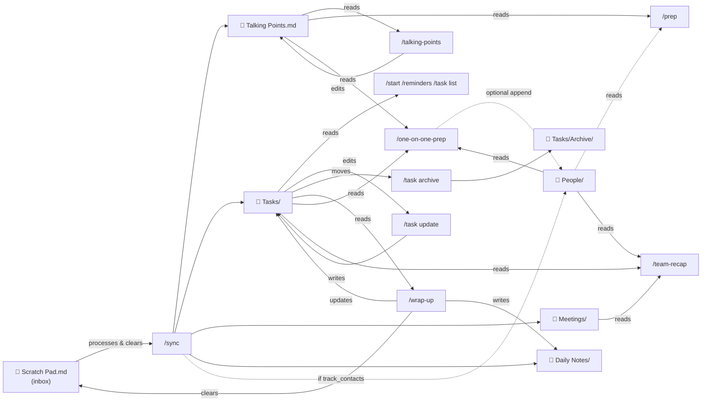

# Contributing to daily-notes

## Technical architecture

### Data flow — what each skill reads and writes

This diagram shows the full file I/O map for every skill. Use it when adding a new skill or changing how an existing one interacts with the file system.



### Task frontmatter schema

Every task file in `Tasks/` uses this YAML frontmatter. All skills must stay consistent with this schema.

```yaml
---
status: open | in-progress | in-review | blocked | done
priority: high | medium | low
due: YYYY-MM-DD          # optional
scheduled: YYYY-MM-DD   # optional
completedDate: YYYY-MM-DD # set when status → done
jira: POE-1234          # optional — links to a Jira issue
jira_url: https://...   # optional — canonical Jira URL
release: v2.4           # optional — free-text release label consumed by /release-notes
tags: []
---
```

`in-review` and `blocked` are valid statuses — all skills that read or write `status` must handle all five values.

The `release:` field is a **free-text label** — exact string matching is used by `/release-notes <label>`. No validation beyond "a string." Skills that write tasks must never invent a label; only set `release:` if the user mentioned one.

### Contact log frontmatter — `People/<Name>/log.md`

Per-person log files accept an optional YAML frontmatter block. The only recognized field is:

```yaml
---
report: true
---
```

`report: true` marks a contact as a direct report. `/team-recap` iterates only over contacts with this field. `/one-on-one-prep` works regardless. No other fields are consumed by any skill — the rest of the log is free-form `## <heading>` + date + body entries.

File modification time (`mtime`) is used as a proxy for "last updated" — there is no explicit `lastUpdated` field. Skills that detect stale tasks (e.g. `/reminders`) rely on this.

### Profile fields (read from `~/.claude/CLAUDE.md`)

Skills read these fields at runtime via the "Daily Notes Plugin Profile" block in the user's global CLAUDE.md:

| Field | Type | Default | Consumed by |
|---|---|---|---|
| `role` | enum `ic \| manager \| po \| other` | `ic` | `/start`, `/wrap-up` (tone + role-specific nudges); gates which skills are surfaced in hints. Any unrecognized string is normalized to `ic`. |
| `track_contacts` | bool | false | `/sync`, `/prep`, `/recap`, `/one-on-one-prep`, `/team-recap` |
| `contacts_folder` | string | `People` | `/sync`, `/prep` |
| `recurring_meetings_label` | string | `1:1` | `/sync` |
| `macos_notifications` | bool | false | `/reminders` |

### Session hooks

Declared in `hooks/hooks.json` and implemented as POSIX shell scripts in `hooks/`. Both hooks must:

- Exit `0` silently when the cwd isn't a daily-notes vault (signature: `Scratch Pad.md` + `Tasks/` exist). Never fail a session for an unrelated project.
- Emit only JSON on stdout in the verified Claude Code hook shapes — `{"hookSpecificOutput":{"hookEventName":"SessionStart","additionalContext":"..."}}` for SessionStart, `{"decision":"block","reason":"..."}` for Stop.
- Never call external services or slash commands, never modify notes. Writes are restricted to `.claude/session-start.epoch` (SessionStart) and `.claude/wrap-up-hinted` (Stop one-shot flag).

`SessionStart` respects the `auto_start_suggestion` profile field (default `true`; set `false` to silence). `Stop` is always-on but self-limits to one nudge per session via the flag, which SessionStart clears on each startup/resume/clear.

When adding new hooks: follow the same gate-first pattern (vault signature → profile opt-out → work), keep runtime under the `timeout` budget declared in `hooks.json`, and document the new hook in `CLAUDE.md` under "Session hooks".

### Error messages — standard pattern

When a skill depends on something that's not available (MCP, macOS permission, missing profile field), it must surface the failure explicitly — never silent degradation. Use this exact pattern so users learn the shape and know where to look:

```
⚠️  <what's missing> — <what's affected>. Run /doctor to diagnose.
```

Examples:
- `⚠️  Atlassian MCP not available in this session — /jira-pull needs live Jira access. Run /doctor to see which integrations are detected, or add an Atlassian MCP in your Claude Code settings.`
- `⚠️  macOS notifications unavailable — osascript call failed. Run /doctor to diagnose …`
- `⚠️  Unblocked MCP not available in this session — /enrich-meeting needs live context. Run /doctor …`

Rules:
1. **Never silently degrade.** If a feature is skipped, the user has to be told — even if the base skill still produces useful output.
2. **Point to /doctor.** Every message ends with "Run /doctor to …" so users learn one diagnostic entry point.
3. **Never fabricate data** to fill the gap (e.g. don't guess calendar events or ticket statuses).
4. **Don't prompt the user to install the missing MCP.** This plugin never manages MCP config — only detects it.

### Adding a new skill

1. Create `skills/<skill-name>/SKILL.md` with YAML frontmatter (`description:`) and natural-language steps.
2. Update `README.md` — add to skills table and usage examples.
3. Update this file — add the skill to the data flow diagram if it reads or writes any files.
4. Follow the error-message pattern above for every external dependency.
5. Use `references/` for shared template content (see below) instead of embedding large templates inline.
6. Bump the patch or minor version in `plugin.json`.

### Shared reference files — `references/`

Skill bodies load into context on every invocation. Large inlined templates, query blocks, or osascript commands balloon that cost. The `references/` directory holds canonical template content that skills point to on demand via `${CLAUDE_PLUGIN_ROOT}/references/<file>.md`.

Current reference files:

| File | Contents | Consumed by |
|---|---|---|
| `references/note-formats.md` | Task, meeting-note, daily-note, contact-log, and 1:1-prep-block formats (plain + Obsidian variants side-by-side). | `/sync`, `/wrap-up`, `/task`, `/one-on-one-prep` |
| `references/obsidian-templates.md` | Dashboard.md Dataview queries and the Daily Note / Meeting Note template literals. | `/obsidian-setup` |
| `references/macos-integration.md` | `osascript` notification and dialog commands, permission-grant instructions, error-handling pattern. | `/reminders` |

**Pattern for new skills that need a template:**

```markdown
## <Section>

The canonical <thing> format lives in `${CLAUDE_PLUGIN_ROOT}/references/<file>.md` under **<Section heading>**. Read it when <condition> — never inline the template here.
```

Skills read the reference file only when the relevant branch is hit (e.g., Obsidian variant selected, macOS notifications enabled). Never read both variants in a single invocation.

**When to add a new reference file:**

- The template exceeds ~30 lines, **and**
- It's duplicated across 2+ skills, **or**
- It changes independently of the skill's control flow.

Small one-off examples can stay inline. The goal is per-invocation token savings on heavy skills — not wholesale extraction.
