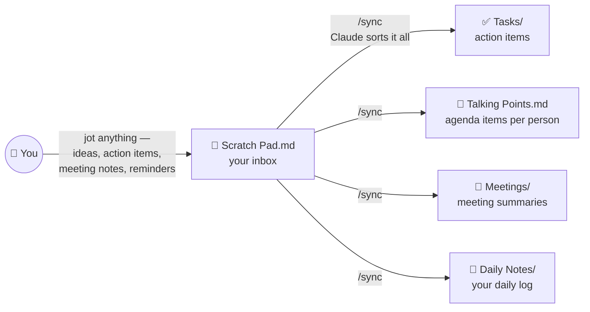
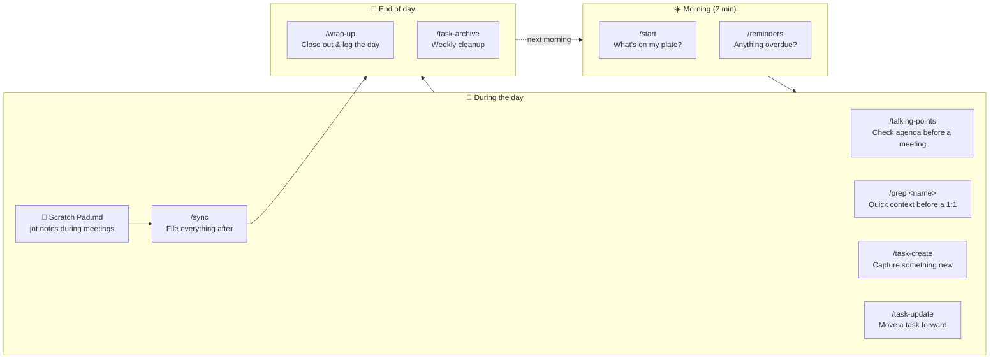
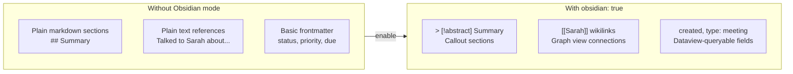
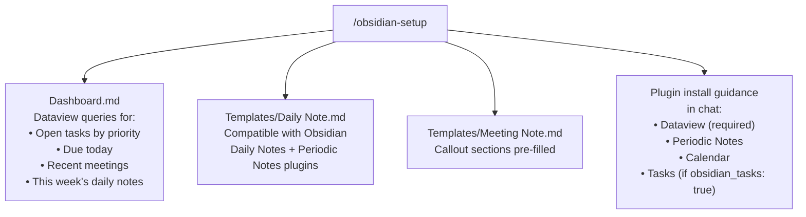

# daily-notes

A personal note-tracking system for Claude Code. Keeps your scratch pad, tasks, meetings, and daily log organized — without leaving your editor.

Works out of the box for anyone. Optionally enable per-person contact tracking by setting a role profile in your global `~/.claude/CLAUDE.md` (see [Configuration](#configuration)).

---

## Requirements

- **[Claude Code](https://docs.anthropic.com/en/docs/claude-code)** — installed and authenticated. That's it.
- **A dedicated folder for your notes** — your project root, `~/Documents/notes/`, anywhere you open Claude Code.
- **Optional: [Obsidian](https://obsidian.md)** — for browsing and editing your notes visually. Any Markdown editor works; Obsidian adds backlinks, graph view, and the Dataview plugin for filtered task views. Nothing in this plugin is Obsidian-specific.

---

## Skills

| Skill | Invoke | What it does |
|-------|--------|--------------|
| First-run setup | `/init` | Interactive scaffold: folder tree, starter files, profile block. Idempotent. |
| Health check | `/doctor` | Verifies folder structure, profile fields, and detects which optional MCPs are available. |
| Morning standup | `/start` | Lists open tasks, suggests today's focus, flags a loaded Scratch Pad |
| Sync notes | `/sync` | Processes Scratch Pad, summarizes new meeting notes, routes talking points, creates tasks, writes daily note |
| Meeting prep | `/prep <name>` | Quick-reference sheet before a meeting: talking points, recent history, related tasks |
| Create task | `/task-create` | Guided task creation with frontmatter (status, priority, due, tags) |
| List tasks | `/task-list` | Filtered task list by status, priority, or tag |
| Update task | `/task-update` | Update status, priority, or notes on an existing task |
| Reminders | `/reminders` | Scans tasks for overdue, due today, due soon, stale in-progress — with optional macOS notifications |
| Talking points | `/talking-points` | View and manage all talking points grouped by person — add, remove, or clear inline |
| Archive tasks | `/task-archive` | Move completed tasks older than N days to Tasks/Archive/ |
| Obsidian setup | `/obsidian-setup` | One-time vault scaffold: Dashboard.md with Dataview queries, daily note + meeting templates |
| End of day | `/wrap-up` | Closes out the day: reviews tasks, prompts for wins/blockers, writes daily note summary |

---

## How it works

### The core idea — one inbox, everything else is automatic

The central habit is simple: **put everything into `Scratch Pad.md`, then run `/sync`**. Claude reads it, files action items as tasks, routes agenda items to the right person, saves meeting notes, and writes your daily log — you never manually sort anything.



### Your day — when to use each skill



> See [CONTRIBUTING.md](CONTRIBUTING.md) for the full file I/O map and schema reference.

---

## File structure

```
<project root>/
├── Scratch Pad.md           # Inbox — dump anything here, /sync files it
├── Talking Points.md        # Topics to raise with specific people
├── Tasks/
│   └── TASK-NAME.md         # One file per task, YAML frontmatter
├── Meetings/
│   └── YYYY-MM-DD Meeting.md
├── Daily Notes/
│   └── YYYY-MM-DD.md
└── People/                  # Only created if track_contacts: true
    └── <Name>/
        ├── Meeting History/
        │   └── YYYY-MM-DD.md
        └── log.md
```

---

## Usage examples

**Morning routine**
```
/start
```
> Lists your in-progress and open tasks, suggests 2-3 things to focus on, and reminds you if Scratch Pad has content.

**Dump notes, let Claude file them**
```
/sync
```
> Processes everything in `Scratch Pad.md`: routes action items to tasks, talking points to `Talking Points.md`, meeting notes to `Meetings/` (or a contact's folder if `track_contacts: true`), and writes today's daily note. Confirms before clearing the Scratch Pad.

**Prep for a meeting**
```
/prep Sarah
```
> Shows: pending talking points for Sarah, open items from her last meeting note, recent contact log entries, and any tasks that mention her.

**Quick task**
```
/task-create
```
> Walks you through naming the task, setting status/priority/due date, and saves it to `Tasks/`.

**Check for urgent tasks**
```
/reminders
```
> Scans all tasks and surfaces overdue, due today, due soon, scheduled today, and stale in-progress items in a prioritized list. Offers to snooze or close items inline. If `macos_notifications: true` is set in your profile, also fires native macOS notifications for overdue and due-today tasks.

**End of day**
```
/wrap-up
```
> Reviews what got done, asks for wins and blockers, closes out the daily note.

**Archive old tasks**
```
/task-archive
/task-archive 14
```
> Scans `Tasks/` for completed tasks older than 7 days (or N days if specified). Shows a list and asks before moving anything to `Tasks/Archive/`.

---

## Daily workflow

```
Morning
  /start           — see what's on your plate
  /reminders       — check for anything urgent or overdue

During the day
  /task-create     — capture new work
  /task-update     — move tasks forward
  /talking-points  — review or add agenda items before meetings
  /prep <name>     — quick context before a 1:1

After meetings
  /sync            — file loose notes from Scratch Pad

End of day
  /wrap-up         — close out tasks, finalize daily note
  /task-archive    — clean up done tasks (weekly or as needed)
```

If you use the `notes-integrations` plugin with Atlassian MCP, replace `/start` with `/start-jira` for a live Jira status view alongside local tasks.

---

## Configuration

The plugin works without any configuration. To enable per-person meeting routing and contact logs, add a profile block to your global `~/.claude/CLAUDE.md`:

```markdown
## Daily Notes Plugin Profile
- role: Software Engineer
- track_contacts: true
- contacts_folder: People
- recurring_meetings_label: 1:1
```

See [`CLAUDE.md`](CLAUDE.md) for the full field reference and example profiles for different roles (IC engineer, consultant, PhD student, etc.).

### Optional: macOS notifications

Add `macos_notifications: true` to your profile to enable native macOS notifications when running `/reminders`:

```markdown
## Daily Notes Plugin Profile
- role: Software Engineer
- track_contacts: true
- contacts_folder: People
- recurring_meetings_label: 1:1
- macos_notifications: true
```

Notifications are off by default. When enabled, overdue and due-today tasks each get their own notification; due-soon and stale items are grouped.

**Approve `osascript` automatically** (recommended): by default Claude Code prompts for permission each time a notification fires. To allow it silently, add this to `~/.claude/settings.json`:

```json
{
  "permissions": {
    "allow": [
      "Bash(osascript:*)"
    ]
  }
}
```

### What `track_contacts: true` unlocks

- `/sync` routes meetings matching `recurring_meetings_label` to `{contacts_folder}/<Name>/Meeting History/` instead of `Meetings/`
- `/sync` writes notable feedback/events to `{contacts_folder}/<Name>/log.md`
- `/prep <name>` surfaces that person's meeting history and log entries

---

## Using with Obsidian

Open your notes folder as an Obsidian vault and add these two fields to your profile for a fully integrated experience:

```markdown
## Daily Notes Plugin Profile
- role: Software Engineer
- track_contacts: true
- contacts_folder: People
- recurring_meetings_label: 1:1
- obsidian: true
- obsidian_tasks: true
```

Then run `/obsidian-setup` once to scaffold your vault.

### What Obsidian mode adds



| Feature | Without | With `obsidian: true` |
|---|---|---|
| Note sections | Plain `## headers` | Callouts (`> [!abstract]`, `> [!warning]`) |
| People references | Plain text | `[[Name]]` wikilinks → graph edges |
| Frontmatter | `status`, `priority`, `due` | + `created`, `type` for Dataview |
| Task files | YAML frontmatter only | + Tasks emoji (`📅 ⏫`) if `obsidian_tasks: true` |
| `/start` + `/reminders` output | Bullet lists | Callouts per urgency level |
| Vault infrastructure | Manual | `/obsidian-setup` generates Dashboard + templates |

### What `/obsidian-setup` creates



### Obsidian graph view

When `obsidian: true` is set, `/sync` writes `[[Name]]` wikilinks in every meeting note and contact log. Over time this builds a rich graph connecting your meetings, people, and daily notes.

### Recommended Obsidian plugins

| Plugin | Required? | What it enables |
|---|---|---|
| **Dataview** | Yes (for Dashboard.md) | Live queries across your vault |
| **Periodic Notes** | Recommended | Weekly, monthly, quarterly notes |
| **Calendar** | Recommended | Sidebar calendar linked to daily notes |
| **Tasks** | Only if `obsidian_tasks: true` | Emoji task syntax across vault |

---

## Installation & setup

### 1. Install the plugin

```bash
claude plugin marketplace add ghaidaatoum/plugin-playground
```
Then install **daily-notes** from the **Discover** tab in `/plugin`.

### 2. Run `/init`

Open Claude Code and run:

```
/init
```

`/init` walks you through a short interactive setup: picks a notes folder (default `~/Documents/notes`), creates the folder tree (`Tasks/`, `Meetings/`, `Daily Notes/`, optional `People/`), seeds `Scratch Pad.md` + `Talking Points.md` + `.claude/memory.md`, and writes your Daily Notes Plugin Profile into `~/.claude/CLAUDE.md`. No shell commands, no manual file editing.

It's idempotent — rerunning against an existing vault offers reuse instead of overwriting.

### 3. Check the install with `/doctor`

```
/doctor
```

`/doctor` reports: folder structure ✓, profile fields ✓, which optional MCPs are detected, and exact fix steps for anything missing. Absent MCPs (Atlassian, Unblocked, Google Calendar) are fine — they're optional upgrades. Run `/doctor` any time something feels off.

### 4. Start your day

```
cd <your-notes-folder> && claude
/start
```

### 5. (Optional) Open in Obsidian

Point Obsidian at your notes folder as a vault. Everything is plain Markdown — no Obsidian-specific setup needed. The [Dataview plugin](https://github.com/blacksmithgu/obsidian-dataview) lets you build filtered task views by status, priority, or due date.
