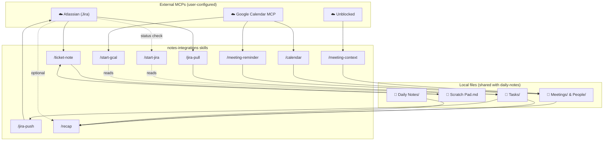
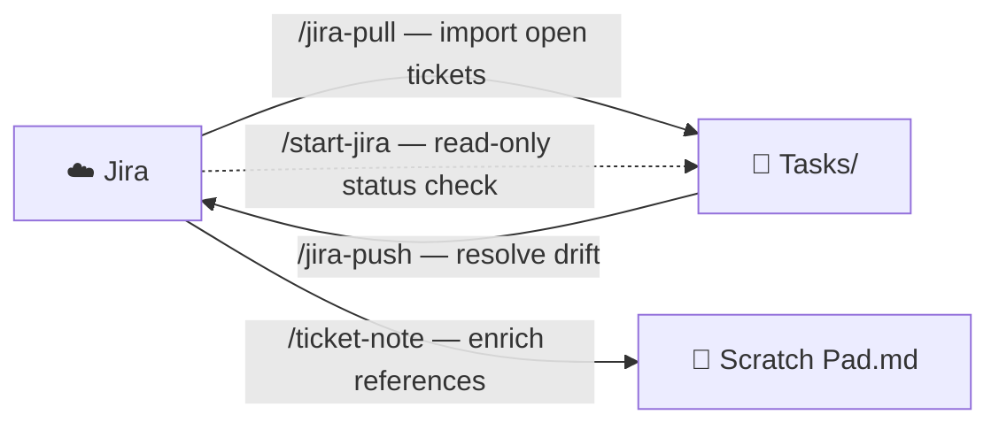

# Contributing to notes-integrations

## Technical architecture

### Plugin layer diagram

`notes-integrations` is a consumer-only plugin. It reads and writes the same local files as `daily-notes` but never declares its own MCP server configs — it relies on MCPs the user has already configured in their Claude Code session.

### Jira sync — data directions

### MCP dependency rules

- **Do not bundle MCP server configs** in `plugin.json`. This plugin must not conflict with other marketplaces (e.g. `poe-foundation-plugin`) that ship the same Atlassian or Unblocked MCPs.
- Each skill must check MCP availability at the start of its run and fail with a clear message — never silently degrade in ways that corrupt local files.
- `/recap` is the only skill with no MCP hard dependency — Atlassian is offered as optional enhancement after the base report is generated.
- **Google Calendar MCP:** The three GCal skills (`/calendar`, `/start-gcal`, `/meeting-reminder`) call `list_events` with `timeMin`, `timeMax`, and `maxResults` parameters. They work with any Google Calendar MCP that exposes `list_events` with this signature. If a user's MCP uses a different tool name, those skills will fail with a clear "Google Calendar unavailable" message — the rest of the plugin is unaffected.

### Status mapping — Jira ↔ local

| Local status | Jira equivalent |
|---|---|
| `open` | To Do |
| `in-progress` | In Progress |
| `in-review` | In Review |
| `done` | Done |
| `blocked` | *(no equivalent — flag to user)* |

### Adding a new skill

1. Create `skills/<skill-name>/SKILL.md` with `description:` frontmatter and natural-language steps.
2. Document which MCP(s) are required and add graceful fallback if unavailable.
3. Update `README.md` — add to skills table (include MCP required column) and add a usage example.
4. Update the Prerequisites table if a new MCP is introduced.
5. Update this file — add the skill to the architecture diagram.
6. Bump the minor version in `plugin.json`.
