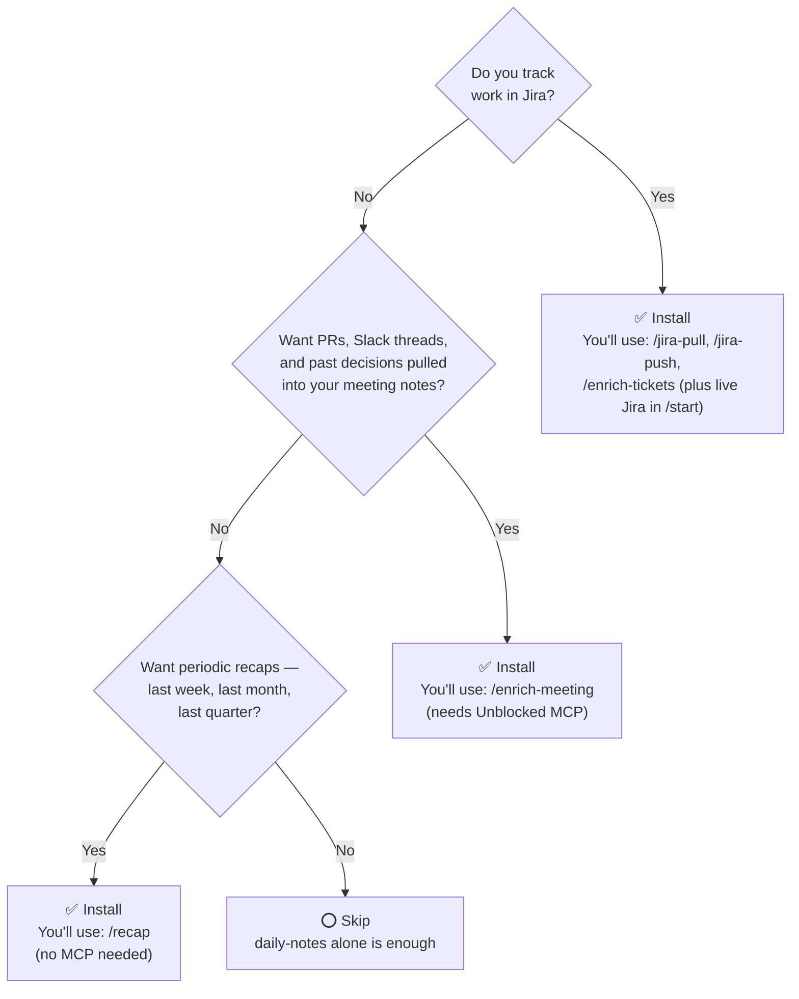
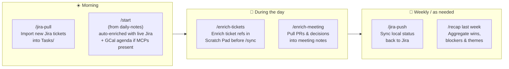

# notes-integrations

MCP-powered enrichment layer for the `daily-notes` plugin. Bridges your local note system with Jira and Unblocked — pull tickets into tasks, surface institutional context in meeting notes, enrich Scratch Pad references, and generate time-window recap reports.

**Requires `daily-notes` to be installed.** Each skill also requires one or more MCP servers (listed per skill below).

---

## Skills

| Skill | Invoke | MCP required | What it does |
|-------|--------|--------------|--------------|
| Pull Jira tickets | `/jira-pull` | Atlassian | Fetches your open/in-progress Jira issues → creates task files in `Tasks/` |
| Push to Jira | `/jira-push` | Atlassian | Surface status drift between local tasks and Jira — choose which source of truth wins, per task |
| Enrich meeting notes | `/enrich-meeting [name] [window?]` | Unblocked | Surfaces related PRs (last 7d), Slack threads (last 3d), and decisions for a person or topic → appends to their meeting note. Pass a window to override: `/enrich-meeting Sarah 30d` |
| Enrich Scratch Pad | `/enrich-tickets` | Atlassian | Finds bare ticket keys in `Scratch Pad.md` (e.g. `POE-123`) and enriches them with title, status, and description before `/sync` |
| Time recap | `/recap` | None (Atlassian optional) | Aggregates daily notes, meetings, and tasks over a time window — last week, last month, last quarter, or a custom date range |
| Calendar agenda | `/calendar` | Google Calendar MCP | Today's and upcoming GCal meetings — flags which have no notes yet, offers to create a blank meeting note |
| Meeting reminder | `/meeting-reminder` | Google Calendar MCP | Nudge for meetings that ended in the last 2 hours with no notes written |

> Morning standup is in `daily-notes` `/start` — it now auto-detects Atlassian and Google Calendar MCPs and enriches the standup accordingly. The old `/start-jira` and `/start-gcal` are gone as of v2.0.0.

---

## Do I need this plugin?



## What it adds to your day

These skills slot into the same daily rhythm as `daily-notes` — just with live data from Jira and Unblocked on top.



> See [CONTRIBUTING.md](CONTRIBUTING.md) for the technical architecture, MCP wiring, and Jira status mapping.

---

## Prerequisites

These MCPs must be configured in your Claude Code session **before** using the skills. The plugin does not bundle MCP server configs — configure them once and they work here automatically.

| MCP | Used by |
|-----|---------|
| Atlassian MCP | `/jira-pull`, `/jira-push`, `/enrich-tickets` — plus live Jira status inside `daily-notes` `/start` |
| Unblocked MCP | `/enrich-meeting` |
| Google Calendar MCP | `/calendar`, `/meeting-reminder` — plus today's agenda inside `daily-notes` `/start` |

Each skill will tell you clearly if a required MCP is not available, rather than failing silently.

> **Google Calendar MCP compatibility:** `/calendar`, `/meeting-reminder`, and the optional agenda block in `daily-notes` `/start` call `list_events` with `timeMin`, `timeMax`, and `maxResults` parameters. They work with any Google Calendar MCP that exposes a `list_events` tool with this signature — not just any specific implementation. If your MCP uses a different tool name, those skills will fail with a clear "Google Calendar unavailable" message; the rest of the plugin is unaffected.

---

## Usage examples

**Sync your Jira board into local tasks**
```
/jira-pull
```
> Fetches your assigned open/in-progress Jira issues. Shows each proposed task one at a time and asks for confirmation before creating a file in `Tasks/`. Skips tickets that already have a task file.

```
Tasks/POE-1234 — migrate-auth-tokens.md   ← created
Tasks/POE-1235 — update-api-docs.md       ← created
Tasks/POE-1200 — fix-login-bug.md         ← skipped (already exists)
```

**Prep for a meeting with Unblocked context**
```
/enrich-meeting Sarah
```
> Queries Unblocked for activity related to Sarah — PRs from the last 7 days, Slack threads from the last 3 days, and any decisions or in-progress work (no time limit). Asks before appending a context block to her most recent meeting note:
```markdown
## Unblocked Context — Sarah (2026-04-02)

**Related PRs** *(last 7 days)*
- PR #892: Refactor session storage — merged last week

**Decisions / Background**
- Auth token storage must use encrypted store per legal review (2026-03-15)
```

Pass a custom window to go deeper — useful for quarterly reviews or first 1:1s:
```
/enrich-meeting Sarah 30d
```

**Morning standup with live Jira status**
```
/start
```
> `/start` lives in `daily-notes`. If the Atlassian MCP is available, it adds live Jira status for every local task with a `jira:` key and flags drift — without auto-updating:
```
[POE-1234] Migrate auth tokens
  Local: in-progress | Jira: In Review ⚠️  — consider updating your task file
```

**Enrich ticket references before syncing**
```
/enrich-tickets
```
> Finds bare keys like `POE-4567` in your `Scratch Pad.md`, fetches their title/status/description from Jira, and asks before enriching them in place. Run this before `/sync` so the enriched note gets filed with full context.

**Generate a time-window recap**
```
/recap last month
/recap last quarter
/recap this week
/recap 2026-01-01 to 2026-03-31
```
> Aggregates your daily notes, meetings, and tasks over the specified window. Works entirely from local files — no MCP needed. If Atlassian MCP is available, it also offers to include Jira tickets resolved in that period.

Sample output:
```
## Recap: Last Month (2026-03-01 – 2026-03-31)

### Highlights
- Shipped auth token migration (POE-1234)
- Unblocked API docs after sync with Sarah

### Meetings
- Total: 8 meetings with 5 unique people
- Recurring themes: auth compliance, Q2 planning
- Unresolved follow-ups: confirm rollback plan with Dave

### Tasks
- Completed: 6  |  Opened: 9  |  Still open: 4  |  Blocked: 1
  Completed: migrate-auth-tokens, update-api-docs, ...

### Blockers / Carryover
- POE-1289 (rate limiter) still blocked on infra approval
```

---

**Resolve status drift with Jira**
```
/jira-push
```
> Scans all tasks with a `jira:` key, fetches live Jira statuses, and shows drift. For each mismatched task, asks whether to push local → Jira or pull Jira → local. Never auto-updates either side.

```
[KEY-123] Fix login bug
Local: done | Jira: In Progress

Which is correct?
1. Push local → Jira  (update Jira to "Done")
2. Pull Jira → local  (update local task to "in-progress")
3. Skip this task
```

---

## Typical workflow

```
Start of day
  /jira-pull         — pull new Jira tickets into Tasks/
  /start             — standup (auto-includes live Jira status + GCal agenda
                        when their MCPs are available)

During the day
  /enrich-tickets    — enrich bare ticket keys in Scratch Pad before /sync
  /sync              — file everything (from daily-notes plugin)

End of week / as needed
  /jira-push         — push local status changes back to Jira
  /recap last week   — summarize the week
```

---

## Google Calendar integration

Requires a Google Calendar MCP configured in your Claude Code session and `gcal: true` in your Daily Notes Plugin Profile.

> **Compatibility:** These skills use `list_events` with `timeMin`, `timeMax`, and `maxResults`. Any Google Calendar MCP that exposes a `list_events` tool with this signature will work.

**View today's agenda and create meeting notes**
```
/calendar
```
> Lists today's GCal meetings, flags which have no local notes yet, and offers to create blank meeting note files.

**Morning standup with GCal**
```
/start
```
> `/start` lives in `daily-notes`. With `gcal: true` in your profile and a Google Calendar MCP in the session, it appends today's agenda, flags meeting-heavy days, and notes if you have talking points for attendees.

**Capture notes after a meeting**
```
/meeting-reminder
```
> Checks for meetings that ended in the last 2 hours with no notes. Prompts you to capture while it's fresh — you can dictate raw notes and it will structure them.

---

## Installation

```bash
claude plugin marketplace add ghaidaatoum/plugin-playground
```
Then install both `daily-notes` and `notes-integrations` from the **Discover** tab in `/plugin`.

After installing, run `/init` once (provided by `daily-notes`) to scaffold your notes folder and profile. Then run `/doctor` — it reports which of the optional MCPs this plugin uses (Atlassian, Unblocked, Google Calendar) are detected in your Claude Code session. Absent MCPs are never errors; the corresponding skills simply stay unavailable.

> **Never-bundled MCPs.** This plugin does not ship, prompt for, or install any MCP server. Add MCPs separately via your Claude Code settings — `/doctor` will pick them up automatically on the next run.
